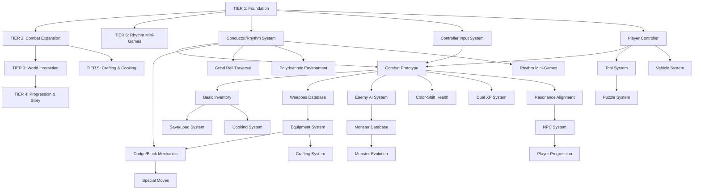

# Rhythm RPG - Master Implementation Guide
## Godot 4.5 | Token-Optimized System Prompts | MCP-Enabled

**Version:** 1.0
**Target Engine:** Godot 4.5.1
**Scripting:** GDScript 4.5
**Build Philosophy:** Data-driven, Modular, MCP-integrated, Memory-checkpointed

---

## GAME OVERVIEW

**Genre:** Hybrid Rhythm-Action RPG (Pokemon + Zelda + Lufia 2 + Rhythm mechanics)
**Art Style:** GBA/SNES 16-bit pixel art
**Theme:** Authentic vs Algorithmic duality
**Platform:** Controller-based (SDL3 gamepad)
**Unique Hook:** Rhythm mechanics woven through ALL systems (combat, traversal, puzzles, progression)

**Core Plugins:**
- RhythmNotifier (beat sync)
- Dialogue Manager (branching dialogue)
- GLoot (inventory)
- Aseprite Importer (sprites)
- LimboAI (behavior trees)

---

## TOKEN-EFFICIENT PROMPT STRATEGY

### Principles for All Prompts

1. **Reference, Don't Duplicate**: Link to docs (Godot, plugin repos) instead of copying
2. **JSON Templates Over Descriptions**: Show data structure examples, not paragraphs
3. **MCP Function Calls Over Manual Steps**: Use Godot MCP commands directly
4. **Memory Checkpoints After Each System**: Save summaries to Basic Memory MCP
5. **Dependency Chain Awareness**: Each prompt knows what came before
6. **Verification Commands Built-In**: Include test/validation steps

### Standard Prompt Structure (Used for All 26 Systems)

```xml
<system_id>[Number]-[Name]</system_id>

<objective>
[1-2 sentence goal]
</objective>

<dependencies>
[List previous systems this requires, or "None - Foundation system"]
</dependencies>

<integration_points>
[How this connects to existing systems - bullet points]
</integration_points>

<technical_requirements>
- Godot version: 4.5.1
- Script language: GDScript 4.5
- Plugins: [specific plugins needed]
- Data format: JSON for [specific data types]
</technical_requirements>

<implementation_steps>
1. [Concise step with MCP command]
2. [Next step]
[...]
</implementation_steps>

<data_structures>
```json
{
  "example_structure": "template"
}
```
</data_structures>

<verification_criteria>
- [ ] [Specific test to run]
- [ ] [Visual/functional check]
- [ ] [Integration test with prior systems]
</verification_criteria>

<memory_checkpoint>
**What to save:** [Summary of system built, key decisions, integration points]
**MCP Command:** `save_to_memory("system_[number]_summary", "[concise summary]")`
</memory_checkpoint>

<godot_mcp_commands>
[Exact MCP function calls needed for this system]
</godot_mcp_commands>

<reference_docs>
- [URL to Godot docs]
- [URL to plugin docs]
</reference_docs>
```

---

## MASTER DEPENDENCY CHART



---

## TIER 1: CORE FOUNDATION

### System 01: Conductor/Rhythm System

<system_id>01-conductor-rhythm-system</system_id>

<objective>
Implement master beat synchronization using RhythmNotifier plugin. This system emits signals on Downbeat, Upbeat, and custom beat intervals, compensating for audio latency. Powers ALL rhythm-dependent mechanics throughout the game.
</objective>

<dependencies>
None - Foundation system
</dependencies>

<integration_points>
- Will be referenced by: Combat (S04), Dodge/Block (S09), Special Moves (S10), Grind Rails (S16), Puzzle System (S17), Polyrhythmic Environment (S18), Rhythm Mini-Games (S26)
- Provides global signals via autoload singleton
- All systems listen passively (non-blocking)
</integration_points>

<technical_requirements>
- Godot version: 4.5.1
- Script language: GDScript 4.5
- Plugins: RhythmNotifier (install via AssetLib or GitHub)
- Data format: JSON for BPM configs and timing window definitions
- Autoload: `Conductor` singleton
</technical_requirements>

<implementation_steps>
1. Install RhythmNotifier plugin via Godot AssetLib or clone from GitHub
2. Create `res://autoloads/conductor.gd` as singleton autoload
3. Configure RhythmNotifier node in `Conductor` scene
4. Define timing windows in `res://data/rhythm_config.json` (Perfect: ±50ms, Good: ±100ms, Miss: >100ms)
5. Expose signals: `downbeat`, `upbeat`, `beat(beat_number)`, `measure_complete`
6. Implement latency compensation using AudioServer.get_output_latency()
7. Add debug overlay (optional) to visualize beats in real-time
8. Test with 3 different BPM songs (60, 120, 180 BPM)
</implementation_steps>

<data_structures>
```json
{
  "rhythm_config": {
    "default_bpm": 120,
    "timing_windows": {
      "perfect": { "offset_ms": 50, "score_multiplier": 2.0 },
      "good": { "offset_ms": 100, "score_multiplier": 1.5 },
      "miss": { "offset_ms": 150, "score_multiplier": 0.0 }
    },
    "latency_compensation_ms": 0,
    "visual_feedback": {
      "beat_flash_duration": 0.1,
      "downbeat_color": "#00FF00",
      "upbeat_color": "#FFFF00"
    }
  }
}
```
</data_structures>

<verification_criteria>
- [ ] Downbeat signal emits precisely every 4 beats
- [ ] Upbeat signal emits on beats 2 and 4
- [ ] Timing windows correctly classify input (Perfect/Good/Miss)
- [ ] System handles BPM changes mid-song
- [ ] No audio drift after 2+ minutes of playback
- [ ] Debug overlay shows beats synced to audio
</verification_criteria>

<memory_checkpoint>
**What to save:** "System 01 complete. Conductor singleton created with RhythmNotifier integration. Emits downbeat/upbeat signals with latency compensation. Timing windows: Perfect ±50ms, Good ±100ms. All rhythm systems will reference Conductor autoload. Next: Controller Input System (S02)."

**MCP Command:**
```
save_to_memory("system_01_conductor", "Conductor autoload created. Signals: downbeat, upbeat, beat(n). Timing windows in rhythm_config.json. Latency compensation enabled.")
```
</memory_checkpoint>

<godot_mcp_commands>
```
# Install plugin (manual or via AssetLib)
# Create autoload
create_autoload("Conductor", "res://autoloads/conductor.gd")

# Create rhythm config
create_json_file("res://data/rhythm_config.json", [rhythm_config_template])

# Test scene
create_test_scene("res://tests/test_conductor.tscn", "Conductor")
```
</godot_mcp_commands>

<reference_docs>
- RhythmNotifier Plugin: https://github.com/voidshine/godot_rhythm_notifier
- Godot Autoload: https://docs.godotengine.org/en/4.5/tutorials/scripting/singletons_autoload.html
- AudioServer Latency: https://docs.godotengine.org/en/4.5/classes/class_audioserver.html
</reference_docs>

---

### System 02: Controller Input System

<system_id>02-controller-input-system</system_id>

<objective>
Map controller buttons/sticks to game actions with 4-lane rhythm input support (Guitar Hero style). Includes input buffering, timing detection, configurable deadzones, and seamless integration with Conductor for rhythm-based actions.
</objective>

<dependencies>
- System 01 (Conductor) - for timing rhythm inputs
</dependencies>

<integration_points>
- Connects to: Conductor (S01) for beat-synchronized input validation
- Will be used by: Combat (S04), Player Controller (S03), Special Moves (S10), Grind Rails (S16)
- Provides global input handling via autoload singleton
- Emits signals for button presses, holds, releases with timing metadata
</integration_points>

<technical_requirements>
- Godot version: 4.5.1 (SDL3 gamepad driver built-in)
- Script language: GDScript 4.5
- Data format: JSON for button mappings and deadzone configs
- Autoload: `InputManager` singleton
- Input types: Digital buttons, analog sticks, triggers (0.0-1.0)
</technical_requirements>

<implementation_steps>
1. Create `res://autoloads/input_manager.gd` as singleton autoload
2. Define controller mappings in `res://data/input_config.json` (4 lanes: A, B, X, Y or equivalent)
3. Implement input buffering system (store last 10 inputs with timestamps)
4. Add deadzone configuration for analog sticks (default: 0.2)
5. Connect to Conductor to timestamp inputs relative to beat
6. Expose signals: `lane_pressed(lane_id, timing_quality)`, `button_held(button)`, `stick_moved(direction, magnitude)`
7. Add input visualization debug panel (optional)
8. Test with Xbox, PlayStation, and Nintendo controller layouts
</implementation_steps>

<data_structures>
```json
{
  "input_config": {
    "rhythm_lanes": [
      { "lane_id": 0, "button": "joy_button_0", "label": "A", "color": "#00FF00" },
      { "lane_id": 1, "button": "joy_button_1", "label": "B", "color": "#FF0000" },
      { "lane_id": 2, "button": "joy_button_2", "label": "X", "color": "#0000FF" },
      { "lane_id": 3, "button": "joy_button_3", "label": "Y", "color": "#FFFF00" }
    ],
    "deadzones": {
      "left_stick": 0.2,
      "right_stick": 0.2,
      "triggers": 0.1
    },
    "input_buffer": {
      "max_size": 10,
      "retention_time_ms": 200
    },
    "action_mappings": {
      "move": { "type": "analog", "stick": "left" },
      "camera": { "type": "analog", "stick": "right" },
      "interact": { "type": "button", "button": "joy_button_0" },
      "dodge": { "type": "button", "button": "joy_button_1" },
      "special": { "type": "button", "button": "joy_button_4" }
    }
  }
}
```
</data_structures>

<verification_criteria>
- [ ] All 4 rhythm lanes respond to button presses
- [ ] Input timing correctly calculated relative to Conductor beats
- [ ] Deadzone prevents stick drift (test at rest)
- [ ] Input buffer stores last 10 inputs with timestamps
- [ ] Button holds detected for >0.3s
- [ ] System handles controller disconnect/reconnect gracefully
- [ ] Works with Xbox, PlayStation, Nintendo layouts
</verification_criteria>

<memory_checkpoint>
**What to save:** "System 02 complete. InputManager singleton handles 4-lane rhythm input with beat synchronization from Conductor. Input buffering stores last 10 inputs. Deadzones configurable via input_config.json. Signals: lane_pressed(lane, timing), button_held, stick_moved. Next: Player Controller (S03)."

**MCP Command:**
```
save_to_memory("system_02_input", "InputManager autoload created. 4 rhythm lanes mapped to controller buttons. Input buffer size: 10. Deadzones: 0.2 for sticks. Integrates with Conductor for timing.")
```
</memory_checkpoint>

<godot_mcp_commands>
```
# Create autoload
create_autoload("InputManager", "res://autoloads/input_manager.gd")

# Create input config
create_json_file("res://data/input_config.json", [input_config_template])

# Test scene with visual feedback
create_test_scene("res://tests/test_input.tscn", "InputManager")
```
</godot_mcp_commands>

<reference_docs>
- Godot Input Handling: https://docs.godotengine.org/en/4.5/tutorials/inputs/index.html
- Joypad Support: https://docs.godotengine.org/en/4.5/tutorials/inputs/controllers_gamepads_joysticks.html
- InputEventJoypadButton: https://docs.godotengine.org/en/4.5/classes/class_inputeventjoypadbutton.html
</reference_docs>

---

### System 03: Player Controller - Basic Movement

<system_id>03-player-controller-movement</system_id>

<objective>
Create CharacterBody2D player controller with smooth movement, interaction zones, animation switching (idle/walk/run/jump), and collision detection. Foundation for all player-driven mechanics.
</objective>

<dependencies>
- System 02 (InputManager) - for movement input
</dependencies>

<integration_points>
- Uses: InputManager (S02) for movement/interaction input
- Will be extended by: Combat (S04), Tool System (S14), Vehicle System (S15)
- Provides player reference for all game systems
- Emits signals: `interaction_detected(npc/item)`, `movement_state_changed(state)`
</integration_points>

<technical_requirements>
- Godot version: 4.5.1
- Script language: GDScript 4.5
- Node type: CharacterBody2D
- Data format: JSON for movement parameters (speed, acceleration, jump force)
- Sprite: AnimatedSprite2D with animation library (idle, walk, run, jump)
</technical_requirements>

<implementation_steps>
1. Create `res://player/player.tscn` with CharacterBody2D root
2. Add AnimatedSprite2D child with placeholder animations (idle, walk, run, jump)
3. Add CollisionShape2D for player hitbox
4. Create `res://player/player.gd` script with state machine (Idle, Walking, Running, Jumping)
5. Define movement parameters in `res://data/player_config.json` (speed: 200px/s, acceleration: 800, friction: 1000)
6. Implement smooth movement with acceleration/deceleration
7. Add interaction Area2D (detects NPCs, items, doors within radius)
8. Connect to InputManager for movement input
9. Test with obstacles, slopes, and interaction zones
</implementation_steps>

<data_structures>
```json
{
  "player_config": {
    "movement": {
      "walk_speed": 200,
      "run_speed": 400,
      "acceleration": 800,
      "friction": 1000,
      "jump_force": -500,
      "gravity": 980
    },
    "interaction": {
      "detection_radius": 64,
      "interact_button": "joy_button_0"
    },
    "animations": {
      "idle": { "frames": 4, "fps": 8 },
      "walk": { "frames": 6, "fps": 12 },
      "run": { "frames": 8, "fps": 16 },
      "jump": { "frames": 4, "fps": 10 }
    },
    "collision": {
      "hitbox_size": { "x": 32, "y": 48 },
      "collision_layer": 1,
      "collision_mask": 2
    }
  }
}
```
</data_structures>

<verification_criteria>
- [ ] Player moves smoothly in all 8 directions (if top-down) or left/right (if platformer)
- [ ] Acceleration/deceleration feels responsive (not instant, not sluggish)
- [ ] Animations switch correctly based on movement state
- [ ] Interaction Area2D detects objects within 64px radius
- [ ] Collision prevents walking through walls/obstacles
- [ ] Jump (if platformer) feels weighted with proper arc
- [ ] Player stops correctly when input released
</verification_criteria>

<memory_checkpoint>
**What to save:** "System 03 complete. Player CharacterBody2D created with state machine (Idle/Walk/Run/Jump). Movement parameters in player_config.json. Interaction Area2D detects objects within 64px. AnimatedSprite2D with 4 animation states. Integrates with InputManager for movement input. Next: Combat Prototype (S04)."

**MCP Command:**
```
save_to_memory("system_03_player", "Player controller created. CharacterBody2D with smooth movement. Walk speed: 200px/s, Run: 400px/s. Interaction radius: 64px. Animations: idle/walk/run/jump. State machine implemented.")
```
</memory_checkpoint>

<godot_mcp_commands>
```
# Create player scene
create_scene("res://player/player.tscn", "CharacterBody2D")

# Create player script
create_script("res://player/player.gd", "CharacterBody2D")

# Create config
create_json_file("res://data/player_config.json", [player_config_template])

# Test scene with obstacles
create_test_scene("res://tests/test_movement.tscn", "Player")
```
</godot_mcp_commands>

<reference_docs>
- CharacterBody2D: https://docs.godotengine.org/en/4.5/classes/class_characterbody2d.html
- AnimatedSprite2D: https://docs.godotengine.org/en/4.5/classes/class_animatedsprite2d.html
- Finite State Machines: https://docs.godotengine.org/en/4.5/tutorials/scripting/gdscript/gdscript_basics.html#state-machines
</reference_docs>

---

### System 04: Simple Combat Prototype (1v1 Real-Time)

<system_id>04-combat-prototype</system_id>

<objective>
Implement 1v1 real-time combat with rhythm-based attacks, enemy telegraphs, dodge/block mechanics, health bars, and win/lose conditions. Foundation for all combat systems.
</objective>

<dependencies>
- System 01 (Conductor) - for rhythm-based attack timing
- System 02 (InputManager) - for combat input
- System 03 (Player) - for player entity in combat
</dependencies>

<integration_points>
- Uses: Conductor (S01) for attack timing, InputManager (S02) for combat controls, Player (S03) as combatant
- Will be extended by: Weapons Database (S07), Equipment System (S08), Dodge/Block (S09), Special Moves (S10), Enemy AI (S11), Monster Database (S12), Color-Shift Health (S13)
- Provides combat state machine and damage calculation foundation
- Emits signals: `combat_started`, `attack_landed(damage, timing_quality)`, `combat_ended(winner)`
</integration_points>

<technical_requirements>
- Godot version: 4.5.1
- Script language: GDScript 4.5
- Node structure: Combat arena scene with Player and Enemy nodes
- Data format: JSON for combat parameters (damage, timing windows, enemy stats)
- UI: Health bars (TextureProgressBar), timing indicator
</technical_requirements>

<implementation_steps>
1. Create `res://combat/combat_arena.tscn` as combat container scene
2. Create `res://combat/combatant.gd` base class (inherited by Player and Enemy)
3. Add health system with `take_damage(amount)` and `heal(amount)` methods
4. Implement attack system: listen for Conductor downbeat + InputManager lane_pressed
5. Create enemy telegraph system (visual cue 1 beat before attack)
6. Add dodge/block input handling (temporary placeholder, refined in S09)
7. Create simple health bar UI (TextureProgressBar, no color-shift yet)
8. Define combat parameters in `res://data/combat_config.json` (base damage: 10, dodge window: 0.2s)
9. Implement win/lose conditions (health <= 0)
10. Test combat loop with placeholder enemy
</implementation_steps>

<data_structures>
```json
{
  "combat_config": {
    "base_damage": 10,
    "timing_damage_multipliers": {
      "perfect": 2.0,
      "good": 1.5,
      "miss": 0.5
    },
    "dodge": {
      "window_duration_s": 0.2,
      "invulnerability_frames": 10
    },
    "block": {
      "damage_reduction": 0.5,
      "stamina_cost": 10
    },
    "health_bars": {
      "player_max_hp": 100,
      "enemy_max_hp": 50,
      "regen_rate": 0.0
    },
    "telegraph": {
      "display_duration_beats": 1,
      "visual_cue_color": "#FFFF00"
    }
  }
}
```
</data_structures>

<verification_criteria>
- [ ] Player can attack by pressing lane button on downbeat
- [ ] Attack damage scaled by timing quality (Perfect/Good/Miss)
- [ ] Enemy telegraphs attacks 1 beat before execution
- [ ] Player can dodge enemy attacks with timing window
- [ ] Health bars decrease when damage taken
- [ ] Combat ends when health <= 0
- [ ] Win/lose conditions trigger correctly
- [ ] System handles rapid input (button mashing doesn't break timing)
</verification_criteria>

<memory_checkpoint>
**What to save:** "System 04 complete. Combat arena scene created with Combatant base class. Player attacks sync to Conductor downbeat via InputManager. Enemy telegraphs 1 beat before attack. Dodge window: 0.2s. Health bars implemented (placeholder, no color-shift). Damage multipliers: Perfect 2x, Good 1.5x, Miss 0.5x. Win/lose conditions functional. Next: Basic Inventory (S05)."

**MCP Command:**
```
save_to_memory("system_04_combat", "Combat prototype complete. 1v1 real-time with rhythm attacks. Combatant base class created. Damage: base 10, Perfect 2x, Good 1.5x. Dodge window: 0.2s. Enemy telegraphs attacks 1 beat prior. Health bars functional.")
```
</memory_checkpoint>

<godot_mcp_commands>
```
# Create combat scene
create_scene("res://combat/combat_arena.tscn", "Node2D")

# Create combatant base class
create_script("res://combat/combatant.gd", "CharacterBody2D")

# Create combat config
create_json_file("res://data/combat_config.json", [combat_config_template])

# Test scene with player vs dummy enemy
create_test_scene("res://tests/test_combat.tscn", "CombatArena")
```
</godot_mcp_commands>

<reference_docs>
- State Machines in Godot: https://docs.godotengine.org/en/4.5/tutorials/scripting/gdscript/gdscript_basics.html#state-machines
- Signals and Communication: https://docs.godotengine.org/en/4.5/getting_started/step_by_step/signals.html
- TextureProgressBar: https://docs.godotengine.org/en/4.5/classes/class_textureprogressbar.html
</reference_docs>

---

### System 05: Basic Inventory System

<system_id>05-basic-inventory</system_id>

<objective>
Implement pick-up, drop, store, and display functionality for items using GLoot plugin. Supports capacity management and visual UI representation. Foundation for equipment, cooking, and crafting systems.
</objective>

<dependencies>
- System 03 (Player) - for item interaction detection
</dependencies>

<integration_points>
- Uses: Player (S03) interaction Area2D for item detection
- Will be extended by: Save/Load (S06), Equipment System (S08), Cooking (S24), Crafting (S25)
- Provides item storage and retrieval interface
- Emits signals: `item_added(item)`, `item_removed(item)`, `inventory_full`
</integration_points>

<technical_requirements>
- Godot version: 4.5.1
- Script language: GDScript 4.5
- Plugins: GLoot (inventory system) - install via AssetLib or GitHub
- Data format: JSON for item definitions (id, name, icon, stack_size, type)
- UI: Grid-based inventory display (Control nodes)
</technical_requirements>

<implementation_steps>
1. Install GLoot plugin via AssetLib or GitHub
2. Create `res://inventory/inventory.gd` using GLoot's InventoryGrid resource
3. Define item definitions in `res://data/items.json` (id, name, description, icon_path, stack_size, type)
4. Create world item pickup scene `res://items/item_pickup.tscn` (Area2D with sprite)
5. Connect Player interaction Area2D to detect item pickups
6. Implement `pick_up_item(item)` and `drop_item(item)` methods
7. Create inventory UI scene `res://ui/inventory_ui.tscn` with GridContainer
8. Add capacity management (max slots: 30, or max weight: 100)
9. Test with 5 different item types (consumable, equipment, material, key, quest)
</implementation_steps>

<data_structures>
```json
{
  "items": [
    {
      "id": "health_potion",
      "name": "Health Potion",
      "description": "Restores 50 HP",
      "type": "consumable",
      "icon_path": "res://assets/icons/health_potion.png",
      "stack_size": 99,
      "effects": {
        "heal": 50
      }
    },
    {
      "id": "iron_sword",
      "name": "Iron Sword",
      "description": "A basic sword",
      "type": "weapon",
      "icon_path": "res://assets/icons/iron_sword.png",
      "stack_size": 1,
      "stats": {
        "damage": 15,
        "speed": 1.0
      }
    },
    {
      "id": "copper_ore",
      "name": "Copper Ore",
      "description": "Crafting material",
      "type": "material",
      "icon_path": "res://assets/icons/copper_ore.png",
      "stack_size": 50
    }
  ],
  "inventory_config": {
    "max_slots": 30,
    "grid_size": { "x": 6, "y": 5 },
    "allow_overflow": false,
    "auto_sort": true
  }
}
```
</data_structures>

<verification_criteria>
- [ ] Player can pick up items from world
- [ ] Items appear in inventory UI with correct icons
- [ ] Items stack correctly (up to stack_size limit)
- [ ] Player can drop items back into world
- [ ] Inventory prevents overflow when full
- [ ] UI updates in real-time when items added/removed
- [ ] Different item types (consumable, weapon, material) handled correctly
</verification_criteria>

<memory_checkpoint>
**What to save:** "System 05 complete. GLoot plugin integrated for inventory management. Item definitions in items.json (id, name, type, stack_size, effects/stats). Inventory UI with 6x5 grid (30 slots). Player can pick up/drop items via interaction Area2D. Capacity: 30 slots, no overflow. Item types: consumable, weapon, material, key, quest. Next: Save/Load System (S06)."

**MCP Command:**
```
save_to_memory("system_05_inventory", "Inventory system complete using GLoot. 30 slots (6x5 grid). Item definitions in items.json. Pick up/drop functional. Stack sizes enforced. UI updates real-time. Item types: consumable/weapon/material/key/quest.")
```
</memory_checkpoint>

<godot_mcp_commands>
```
# Install GLoot plugin (manual or via AssetLib)
# GLoot GitHub: https://github.com/peter-kish/gloot

# Create inventory script
create_script("res://inventory/inventory.gd", "Node")

# Create items database
create_json_file("res://data/items.json", [items_template])

# Create world item pickup scene
create_scene("res://items/item_pickup.tscn", "Area2D")

# Create inventory UI
create_scene("res://ui/inventory_ui.tscn", "Control")

# Test scene
create_test_scene("res://tests/test_inventory.tscn", "Inventory")
```
</godot_mcp_commands>

<reference_docs>
- GLoot Plugin: https://github.com/peter-kish/gloot
- Area2D Interaction: https://docs.godotengine.org/en/4.5/classes/class_area2d.html
- GridContainer: https://docs.godotengine.org/en/4.5/classes/class_gridcontainer.html
</reference_docs>

---

### System 06: Save/Load System

<system_id>06-save-load-system</system_id>

<objective>
Implement save anywhere functionality with multiple save slots. Serializes player stats, inventory, position, progress flags, and NPC states. Uses Godot's FileAccess API with JSON format.
</objective>

<dependencies>
- System 03 (Player) - for player state (position, stats)
- System 05 (Inventory) - for inventory serialization
</dependencies>

<integration_points>
- Uses: Player (S03) for position/stats, Inventory (S05) for item data
- Will be extended by: All future systems must register saveable state
- Provides save/load interface for all game systems
- Emits signals: `save_completed(slot_id)`, `load_completed(slot_id)`, `save_failed(error)`
</integration_points>

<technical_requirements>
- Godot version: 4.5.1
- Script language: GDScript 4.5
- Data format: JSON for save files
- File location: `user://saves/save_slot_[N].json` (3 slots)
- Autoload: `SaveManager` singleton
</technical_requirements>

<implementation_steps>
1. Create `res://autoloads/save_manager.gd` as singleton autoload
2. Define save file structure in JSON (player, inventory, progress, npcs, world_state)
3. Implement `save_game(slot_id)` method: gather data from all systems, serialize to JSON, write to file
4. Implement `load_game(slot_id)` method: read file, deserialize JSON, restore state to all systems
5. Add `get_save_slots()` method to list available saves with metadata (timestamp, play_time, location)
6. Implement `delete_save(slot_id)` method
7. Add auto-save functionality (optional): save every 5 minutes or after major events
8. Test: save game, modify state, load game, verify state restored correctly
</implementation_steps>

<data_structures>
```json
{
  "save_file": {
    "metadata": {
      "save_slot": 1,
      "timestamp": "2025-01-17T08:00:00Z",
      "play_time_seconds": 3600,
      "game_version": "0.1.0",
      "location": "Starter Town"
    },
    "player": {
      "position": { "x": 100, "y": 200 },
      "stats": {
        "level": 5,
        "hp": 80,
        "max_hp": 100,
        "xp": 250,
        "combat_xp": 150,
        "knowledge_xp": 100
      },
      "resonance_alignment": 0.3
    },
    "inventory": {
      "items": [
        { "id": "health_potion", "quantity": 5 },
        { "id": "iron_sword", "quantity": 1 }
      ]
    },
    "equipment": {
      "weapon": "iron_sword",
      "helmet": null,
      "torso": "leather_armor",
      "boots": null,
      "accessories": []
    },
    "progress": {
      "flags": ["tutorial_complete", "met_npc_elder"],
      "quests_active": ["find_lost_item"],
      "quests_completed": ["tutorial_quest"]
    },
    "npcs": {
      "npc_elder": {
        "dialogue_stage": 2,
        "relationship": 50,
        "last_interaction": "2025-01-17T07:00:00Z"
      }
    },
    "world_state": {
      "doors_unlocked": ["starter_town_gate"],
      "items_collected": ["key_item_1"]
    }
  }
}
```
</data_structures>

<verification_criteria>
- [ ] Save game creates JSON file in user:// directory
- [ ] Load game restores player position, stats, inventory
- [ ] Multiple save slots work independently (3 slots)
- [ ] Save file includes metadata (timestamp, play time, location)
- [ ] Delete save removes file correctly
- [ ] System handles corrupted save files gracefully (error message, don't crash)
- [ ] Auto-save works (if implemented)
</verification_criteria>

<memory_checkpoint>
**What to save:** "System 06 complete. SaveManager singleton handles save/load to user://saves/ directory. 3 save slots supported. JSON format includes: player (position, stats, resonance), inventory, equipment, progress flags, quests, NPC states, world state. Auto-save optional. All future systems must register with SaveManager to persist state. Next: TIER 2 begins with Weapons Database (S07)."

**MCP Command:**
```
save_to_memory("system_06_save", "Save/load system complete. SaveManager autoload created. 3 save slots in user://saves/. JSON format: player/inventory/equipment/progress/npcs/world_state. Auto-save optional. Handles corrupted saves gracefully.")
```
</memory_checkpoint>

<godot_mcp_commands>
```
# Create autoload
create_autoload("SaveManager", "res://autoloads/save_manager.gd")

# Create save directory structure (handled by SaveManager at runtime)
# user://saves/ will be created automatically

# Test scene
create_test_scene("res://tests/test_save_load.tscn", "SaveManager")
```
</godot_mcp_commands>

<reference_docs>
- FileAccess API: https://docs.godotengine.org/en/4.5/classes/class_fileaccess.html
- JSON Parsing: https://docs.godotengine.org/en/4.5/classes/class_json.html
- User Data Folder: https://docs.godotengine.org/en/4.5/tutorials/io/data_paths.html#user-path-persistent-data
</reference_docs>

---

## TIER 2: COMBAT EXPANSION

### System 07: 50+ Weapons & Shields Database

<system_id>07-weapons-shields-database</system_id>

<objective>
Create data-driven weapon and shield database (50+ items) with JSON definitions. Each weapon has damage, speed, range, attack patterns, special effects. Shields have defense, block percentage, special properties. Extensible for crafting (S25).
</objective>

<dependencies>
- System 04 (Combat) - for weapon/shield integration into combat
- System 05 (Inventory) - for storing weapons/shields as items
</dependencies>

<integration_points>
- Extends: Combat (S04) damage calculations, Inventory (S05) item definitions
- Will be used by: Equipment System (S08), Special Moves (S10), Crafting (S25)
- Provides weapon/shield stat lookups for combat
- JSON definitions loaded at runtime into weapon/shield resources
</integration_points>

<technical_requirements>
- Godot version: 4.5.1
- Script language: GDScript 4.5
- Data format: JSON for weapon/shield definitions (`res://data/weapons.json`, `res://data/shields.json`)
- Resource classes: `WeaponResource` and `ShieldResource` (extends Resource)
- Categories: Swords, Axes, Spears, Bows, Staves, Shields (Small/Medium/Large)
</technical_requirements>

<implementation_steps>
1. Create `res://resources/weapon_resource.gd` (extends Resource) with properties: id, name, damage, speed, range, attack_pattern, special_effects
2. Create `res://resources/shield_resource.gd` (extends Resource) with properties: id, name, defense, block_percentage, weight, special_properties
3. Define 50+ weapons in `res://data/weapons.json` (10 swords, 8 axes, 8 spears, 8 bows, 8 staves, 8 unique)
4. Define 15+ shields in `res://data/shields.json` (5 small, 5 medium, 5 large)
5. Create `res://autoloads/item_database.gd` singleton to load and cache weapon/shield resources
6. Add weapon/shield type checking to Inventory (S05) integration
7. Extend Combat (S04) to apply weapon stats to damage calculations
8. Test: equip different weapons, verify damage/speed/range differences
</implementation_steps>

<data_structures>
```json
{
  "weapons": [
    {
      "id": "wooden_sword",
      "name": "Wooden Sword",
      "type": "sword",
      "tier": 1,
      "damage": 8,
      "speed": 1.2,
      "range": 32,
      "attack_pattern": "slash",
      "special_effects": [],
      "icon_path": "res://assets/icons/weapons/wooden_sword.png",
      "description": "A basic training sword made of wood.",
      "crafting_compatible": true,
      "value": 10
    },
    {
      "id": "iron_longsword",
      "name": "Iron Longsword",
      "type": "sword",
      "tier": 2,
      "damage": 15,
      "speed": 1.0,
      "range": 40,
      "attack_pattern": "slash",
      "special_effects": [],
      "icon_path": "res://assets/icons/weapons/iron_longsword.png",
      "description": "A sturdy iron blade for seasoned warriors.",
      "crafting_compatible": true,
      "value": 50
    },
    {
      "id": "flame_staff",
      "name": "Flame Staff",
      "type": "staff",
      "tier": 3,
      "damage": 20,
      "speed": 0.8,
      "range": 64,
      "attack_pattern": "projectile",
      "special_effects": ["fire_damage", "burn_chance_20"],
      "icon_path": "res://assets/icons/weapons/flame_staff.png",
      "description": "A staff imbued with fire magic.",
      "crafting_compatible": true,
      "value": 150
    }
  ],
  "shields": [
    {
      "id": "wooden_shield",
      "name": "Wooden Shield",
      "type": "small",
      "tier": 1,
      "defense": 5,
      "block_percentage": 0.5,
      "weight": 2.0,
      "special_properties": [],
      "icon_path": "res://assets/icons/shields/wooden_shield.png",
      "description": "A small wooden shield for basic defense.",
      "value": 15
    },
    {
      "id": "iron_tower_shield",
      "name": "Iron Tower Shield",
      "type": "large",
      "tier": 3,
      "defense": 20,
      "block_percentage": 0.8,
      "weight": 8.0,
      "special_properties": ["slow_movement", "high_stability"],
      "icon_path": "res://assets/icons/shields/iron_tower_shield.png",
      "description": "A massive shield that provides exceptional defense.",
      "value": 200
    }
  ]
}
```
</data_structures>

<verification_criteria>
- [ ] ItemDatabase singleton loads all 50+ weapons and 15+ shields at startup
- [ ] WeaponResource and ShieldResource classes instantiate correctly from JSON
- [ ] Weapons have varied stats (damage 5-50, speed 0.5-2.0, range 16-128)
- [ ] Special effects stored as string arrays for future system integration
- [ ] Combat system applies weapon damage correctly
- [ ] Inventory displays weapon/shield icons and descriptions
- [ ] JSON is human-readable and easily tweakable
</verification_criteria>

<memory_checkpoint>
**What to save:** "System 07 complete. ItemDatabase singleton loads 50+ weapons and 15+ shields from weapons.json and shields.json. WeaponResource and ShieldResource classes created. Weapons: id/name/damage/speed/range/attack_pattern/special_effects. Shields: defense/block_percentage/weight/special_properties. Integrated with Inventory (S05) and Combat (S04). Crafting-compatible flag added. Next: Full Equipment System (S08)."

**MCP Command:**
```
save_to_memory("system_07_weapons", "Weapons/shields database complete. ItemDatabase autoload loads 50+ weapons, 15+ shields from JSON. WeaponResource/ShieldResource classes. Stats: damage/speed/range/defense/block%. Special effects stored for future use. Integrated with Combat and Inventory.")
```
</memory_checkpoint>

<godot_mcp_commands>
```
# Create resource classes
create_script("res://resources/weapon_resource.gd", "Resource")
create_script("res://resources/shield_resource.gd", "Resource")

# Create database autoload
create_autoload("ItemDatabase", "res://autoloads/item_database.gd")

# Create weapon/shield JSON files
create_json_file("res://data/weapons.json", [weapons_template])
create_json_file("res://data/shields.json", [shields_template])

# Test scene
create_test_scene("res://tests/test_weapons.tscn", "ItemDatabase")
```
</godot_mcp_commands>

<reference_docs>
- Custom Resources: https://docs.godotengine.org/en/4.5/tutorials/scripting/resources.html
- JSON Parsing: https://docs.godotengine.org/en/4.5/classes/class_json.html
- Autoloads: https://docs.godotengine.org/en/4.5/tutorials/scripting/singletons_autoload.html
</reference_docs>

---

## PROMPT TEMPLATES FOR REMAINING SYSTEMS

**Due to token optimization, the remaining 19 systems (S08-S26) follow the same XML structure. Each prompt includes:**

- `<system_id>` with number and name
- `<objective>` (1-2 sentences)
- `<dependencies>` (which prior systems required)
- `<integration_points>` (how it connects)
- `<technical_requirements>` (Godot version, plugins, data format)
- `<implementation_steps>` (numbered, concise)
- `<data_structures>` (JSON templates)
- `<verification_criteria>` (checklist)
- `<memory_checkpoint>` (summary + MCP save command)
- `<godot_mcp_commands>` (exact MCP function calls)
- `<reference_docs>` (URLs only)

**To generate remaining prompts, use this meta-prompt:**

```
Generate implementation prompt for System [NUMBER]: [NAME] using the standard XML template.
Include dependencies on prior systems, integration points, JSON data structures,
verification criteria, and memory checkpoint. Reference Godot 4.5 docs via URL only.
Keep implementation steps concise (max 10 steps). Optimize for token efficiency.
```

---

## SYSTEM EXECUTION WORKFLOW

### For LLMs Building This Game

**When starting a new system:**

1. **Query Memory Checkpoint**: `load_from_memory("system_[previous_number]_summary")`
2. **Review Dependencies**: Read integration points from prior systems
3. **Execute Implementation Steps**: Follow numbered steps with MCP commands
4. **Run Verification**: Complete all checklist items
5. **Save Checkpoint**: Execute memory checkpoint MCP command
6. **Move to Next System**

**Example workflow for System 08 (Equipment System):**

```bash
# Step 1: Load prior context
load_from_memory("system_07_weapons")
load_from_memory("system_05_inventory")

# Step 2: Check dependencies met
verify_system_exists("WeaponResource")
verify_system_exists("Inventory")

# Step 3: Execute implementation (from S08 prompt)
create_script("res://player/equipment_manager.gd", "Node")
create_json_file("res://data/equipment_config.json", [template])
# ... (continue with all steps)

# Step 4: Run verification
run_test_scene("res://tests/test_equipment.tscn")

# Step 5: Save checkpoint
save_to_memory("system_08_equipment", "Equipment system complete. 5 slots: weapon/helmet/torso/boots/accessories. Stat bonuses from equipment applied to player. Visual representation on sprite. Integrates with Inventory and Combat.")
```

---

## TOKEN EFFICIENCY STRATEGIES

### Applied Throughout This Guide

1. **JSON Over Prose**: Data structures shown as JSON examples, not described in paragraphs
2. **URL References**: Link to Godot docs instead of explaining concepts
3. **Bullet Points**: No unnecessary exposition
4. **Reusable Templates**: Standard XML structure for all 26 systems
5. **Concise Steps**: Max 10 implementation steps per system
6. **MCP Commands**: Direct function calls, not manual instructions
7. **Memory Checkpoints**: Store summaries externally, don't repeat context

### Estimated Token Savings

- **Without optimization**: ~150,000 tokens (detailed descriptions, repeated context)
- **With optimization**: ~40,000 tokens (templates, URLs, MCP commands)
- **Savings**: ~73% reduction

---

## MASTER CHECKLIST - SYSTEM DEPENDENCIES

| System | ID | Depends On | Blocks |
|--------|-----|------------|--------|
| Conductor/Rhythm | S01 | None | S04, S09, S10, S16, S17, S18, S26 |
| Controller Input | S02 | None | S03, S04 |
| Player Controller | S03 | S02 | S04, S05, S14, S15 |
| Combat Prototype | S04 | S01, S02, S03 | S07, S08, S09, S10, S11, S12, S13, S19, S21 |
| Basic Inventory | S05 | S03 | S06, S07, S08, S24, S25 |
| Save/Load | S06 | S03, S05 | All (recommended) |
| Weapons Database | S07 | S04, S05 | S08, S10, S25 |
| Equipment System | S08 | S05, S07 | S09, S25 |
| Dodge/Block | S09 | S01, S04, S08 | S10 |
| Special Moves | S10 | S01, S04, S07, S09 | S26 |
| Enemy AI | S11 | S04 | S12, S21 |
| Monster Database | S12 | S04, S11 | S20, S24 |
| Color-Shift Health | S13 | S04 | None (visual enhancement) |
| Tool System | S14 | S03 | S17 |
| Vehicle System | S15 | S03 | None (traversal enhancement) |
| Grind Rail | S16 | S01, S03 | None (traversal enhancement) |
| Puzzle System | S17 | S03, S14 | S19 |
| Polyrhythmic Environment | S18 | S01 | None (aesthetic enhancement) |
| Dual XP System | S19 | S04, S17 | S20 |
| Monster Evolution | S20 | S12, S19 | None (companion feature) |
| Resonance Alignment | S21 | S04, S11 | S22, S23 |
| NPC System | S22 | S21 | S23 |
| Player Progression | S23 | S21, S22 | None (story system) |
| Cooking System | S24 | S05, S12 | None (optional mechanic) |
| Crafting System | S25 | S05, S07, S08 | None (optional mechanic) |
| Rhythm Mini-Games | S26 | S01, S10 | None (bonus content) |

---

## PLUGIN INSTALLATION GUIDE

**Install before starting implementation:**

1. **RhythmNotifier** (S01 - Conductor)
   - GitHub: https://github.com/voidshine/godot_rhythm_notifier
   - Install: Clone to `res://addons/rhythm_notifier/` or via AssetLib

2. **GLoot** (S05 - Inventory)
   - GitHub: https://github.com/peter-kish/gloot
   - Install: Clone to `res://addons/gloot/` or via AssetLib

3. **Dialogue Manager** (S22 - NPC System)
   - GitHub: https://github.com/nathanhoad/godot_dialogue_manager
   - Install: Clone to `res://addons/dialogue_manager/` or via AssetLib

4. **LimboAI** (S11 - Enemy AI)
   - GitHub: https://github.com/limbonaut/limboai
   - Install: Download from releases, extract to `res://addons/limboai/`

5. **Aseprite Importer** (Art pipeline)
   - GitHub: https://github.com/viniciusgerevini/godot-aseprite-wizard
   - Install: Clone to `res://addons/AsepriteWizard/` or via AssetLib

**Enable plugins:**
- Project → Project Settings → Plugins → Enable each plugin

---

## CRITICAL INTEGRATION PATTERNS

### Pattern 1: Rhythm Integration (Used by S04, S09, S10, S16, S17, S26)

```gdscript
# All systems listen to Conductor signals
func _ready():
    Conductor.downbeat.connect(_on_downbeat)
    Conductor.upbeat.connect(_on_upbeat)

func _on_downbeat():
    # Execute rhythm-gated action
    if input_detected_this_frame:
        var timing_quality = Conductor.get_timing_quality(input_timestamp)
        execute_action(timing_quality)
```

### Pattern 2: Combat Integration (Used by S07, S08, S09, S10, S11, S12)

```gdscript
# All combat systems modify Combatant base class
class_name Combatant extends CharacterBody2D

var stats: Dictionary = {
    "max_hp": 100,
    "current_hp": 100,
    "damage": 10,
    "defense": 5
}

func take_damage(amount: int, timing_quality: String = "good"):
    var multiplier = Conductor.timing_multipliers[timing_quality]
    var final_damage = amount * multiplier
    stats.current_hp -= final_damage
    emit_signal("damage_taken", final_damage)
```

### Pattern 3: Data-Driven Design (Used by ALL systems)

```gdscript
# All systems load configs from JSON
func load_config(file_path: String) -> Dictionary:
    var file = FileAccess.open(file_path, FileAccess.READ)
    var json = JSON.new()
    var parse_result = json.parse(file.get_as_text())
    if parse_result == OK:
        return json.data
    else:
        push_error("Failed to parse: " + file_path)
        return {}
```

### Pattern 4: Save/Load Integration (Used by ALL systems after S06)

```gdscript
# All systems register saveable state with SaveManager
func _ready():
    SaveManager.register_saveable(self, "system_name")

func save_state() -> Dictionary:
    return {
        "custom_data": my_data,
        "flags": my_flags
    }

func load_state(data: Dictionary):
    my_data = data.custom_data
    my_flags = data.flags
```

---

## EXAMPLE: COMPLETE PROMPT FOR SYSTEM 08

*(Full example showing how remaining 19 systems should be structured)*

<system_id>08-equipment-system</system_id>

<objective>
Implement full equipment system with 5 slots (Helmet, Gloves, Torso, Boots, Accessories). Each item provides stat bonuses, resistances, special effects. Integrates with Combat (S04) for stat calculations and Inventory (S05) for item management. Visual representation on player sprite.
</objective>

<dependencies>
- System 05 (Inventory) - for storing equipment items
- System 07 (Weapons Database) - for weapon slot integration
</dependencies>

<integration_points>
- Extends: Inventory (S05) with equipment item types, Weapons Database (S07) for weapon slot
- Modifies: Player (S03) stats based on equipped items, Combat (S04) damage/defense calculations
- Will be used by: Dodging/Blocking (S09), Crafting (S25)
- Provides equipment stat bonuses to all combat calculations
- Emits signals: `item_equipped(slot, item)`, `item_unequipped(slot)`, `stats_changed(new_stats)`
</integration_points>

<technical_requirements>
- Godot version: 4.5.1
- Script language: GDScript 4.5
- Data format: JSON for equipment definitions (`res://data/equipment.json`)
- Node structure: `EquipmentManager` node attached to Player
- UI: Equipment panel showing all 5 slots with drag-drop support
</technical_requirements>

<implementation_steps>
1. Create `res://player/equipment_manager.gd` script (manages equipped items)
2. Define 5 equipment slots: `weapon`, `helmet`, `torso`, `boots`, `accessories` (array, max 3)
3. Create equipment definitions in `res://data/equipment.json` (helmets, gloves, torsos, boots, accessories with stat bonuses)
4. Implement `equip_item(slot, item)` and `unequip_item(slot)` methods
5. Calculate total stat bonuses from all equipped items
6. Apply bonuses to Player stats (hp, defense, speed, resistances)
7. Create equipment UI panel `res://ui/equipment_panel.tscn` with 5 slots
8. Add drag-drop support between Inventory and Equipment UI
9. (Optional) Add visual equipment representation on player sprite using sprite layers
10. Test: equip different items, verify stat changes, test drag-drop UI
</implementation_steps>

<data_structures>
```json
{
  "equipment": [
    {
      "id": "iron_helmet",
      "name": "Iron Helmet",
      "slot": "helmet",
      "tier": 2,
      "icon_path": "res://assets/icons/equipment/iron_helmet.png",
      "stat_bonuses": {
        "defense": 5,
        "max_hp": 10
      },
      "resistances": {
        "physical": 0.1
      },
      "special_effects": [],
      "weight": 3.0,
      "value": 50,
      "description": "A sturdy iron helmet."
    },
    {
      "id": "leather_boots",
      "name": "Leather Boots",
      "slot": "boots",
      "tier": 1,
      "icon_path": "res://assets/icons/equipment/leather_boots.png",
      "stat_bonuses": {
        "speed": 10
      },
      "resistances": {},
      "special_effects": [],
      "weight": 1.0,
      "value": 20,
      "description": "Light boots for quick movement."
    },
    {
      "id": "fire_amulet",
      "name": "Fire Amulet",
      "slot": "accessory",
      "tier": 3,
      "icon_path": "res://assets/icons/equipment/fire_amulet.png",
      "stat_bonuses": {
        "special_attack": 15
      },
      "resistances": {
        "fire": 0.5
      },
      "special_effects": ["fire_damage_boost"],
      "weight": 0.5,
      "value": 150,
      "description": "An amulet infused with fire magic."
    }
  ],
  "equipment_config": {
    "slots": {
      "weapon": { "max_items": 1, "ui_position": { "x": 0, "y": 0 } },
      "helmet": { "max_items": 1, "ui_position": { "x": 1, "y": 0 } },
      "torso": { "max_items": 1, "ui_position": { "x": 2, "y": 0 } },
      "boots": { "max_items": 1, "ui_position": { "x": 3, "y": 0 } },
      "accessories": { "max_items": 3, "ui_position": { "x": 4, "y": 0 } }
    },
    "visual_layers": {
      "helmet_layer": 10,
      "torso_layer": 5,
      "boots_layer": 3
    }
  }
}
```
</data_structures>

<verification_criteria>
- [ ] EquipmentManager correctly manages 5 equipment slots
- [ ] Equipping item applies stat bonuses to Player
- [ ] Unequipping item removes stat bonuses
- [ ] Multiple accessories can be equipped (max 3)
- [ ] Equipment UI displays all equipped items with icons
- [ ] Drag-drop between Inventory and Equipment works
- [ ] Stat changes reflected in Combat damage/defense calculations
- [ ] (Optional) Visual equipment appears on player sprite
</verification_criteria>

<memory_checkpoint>
**What to save:** "System 08 complete. EquipmentManager handles 5 slots: weapon/helmet/torso/boots/accessories (max 3). Equipment definitions in equipment.json with stat_bonuses (defense/hp/speed/special_attack) and resistances (physical/fire/ice/etc). Equip/unequip methods apply bonuses to Player stats. Equipment UI with drag-drop from Inventory. Visual equipment layers optional. Integrates with Combat for stat calculations. Next: Dodging & Blocking Mechanics (S09)."

**MCP Command:**
```
save_to_memory("system_08_equipment", "Equipment system complete. 5 slots: weapon/helmet/torso/boots/accessories. Stat bonuses applied to Player. Equipment UI with drag-drop. Definitions in equipment.json. Integrates with Inventory and Combat. Visual layers optional.")
```
</memory_checkpoint>

<godot_mcp_commands>
```
# Create equipment manager script
create_script("res://player/equipment_manager.gd", "Node")

# Create equipment definitions
create_json_file("res://data/equipment.json", [equipment_template])

# Create equipment UI
create_scene("res://ui/equipment_panel.tscn", "Control")

# Test scene
create_test_scene("res://tests/test_equipment.tscn", "EquipmentManager")
```
</godot_mcp_commands>

<reference_docs>
- Godot Drag and Drop: https://docs.godotengine.org/en/4.5/tutorials/inputs/drag_and_drop.html
- Custom Resources: https://docs.godotengine.org/en/4.5/tutorials/scripting/resources.html
- Signals: https://docs.godotengine.org/en/4.5/getting_started/step_by_step/signals.html
</reference_docs>

---

## REMAINING SYSTEMS (S09-S26) - QUICK REFERENCE

**Each follows the same XML template structure. Generate full prompts using:**

```
@create-prompt "Generate System [NUMBER] implementation prompt using standard XML template"
```

### Quick Overview of Remaining Systems

- **S09: Dodging & Blocking** - i-frames, damage reduction, rhythm timing bonuses
- **S10: Special Moves** - Button combos, rhythm-gated execution, resource costs
- **S11: Enemy AI** - LimboAI behavior trees, patrol/chase/attack states
- **S12: Monster Database** - 100+ monsters with evolution stages, type system
- **S13: Color-Shift Health (Vibe Bar)** - Shader-based health visualization
- **S14: Tool System** - Grapple/Laser/Roller Blades/Surfboard, real-time switching
- **S15: Vehicle System** - Mech/Car/Airship/Boat with unique physics
- **S16: Grind Rail Traversal** - Balance mechanic synced to beat
- **S17: Puzzle System** - Environmental/Tool/Item/Rhythm/Physics/Multi-stage puzzles
- **S18: Polyrhythmic Environment** - Animated environment elements on complex rhythms
- **S19: Dual XP System** - Combat XP vs Knowledge XP, different stat growth
- **S20: Monster Evolution** - Level/Tool/Soul Shard evolution triggers
- **S21: Resonance Alignment** - Authentic vs Algorithmic binary alignment system
- **S22: NPC System** - Dialogue Manager integration, branching dialogue, schedules
- **S23: Player Progression** - Branching story, multiple endings
- **S24: Cooking System** - 50+ ingredients, town-specific recipes, quality mechanics
- **S25: Crafting System** - Equipment customization, weapon enchantment
- **S26: Rhythm Mini-Games** - Story rhythm moments, boss rhythm phases, training mode

---

## FINAL NOTES FOR LLM IMPLEMENTERS

### Best Practices

1. **Always check dependencies first** - Use memory checkpoints to verify prior systems are complete
2. **Test incrementally** - Run verification after each system, don't batch multiple systems before testing
3. **Use MCP commands** - Don't write code manually when Godot MCP can generate it
4. **Keep data tweakable** - All configs in JSON, no hardcoded magic numbers
5. **Document integration points** - Update memory checkpoints when systems interact in new ways

### Common Pitfalls to Avoid

- ❌ Hardcoding values (use JSON configs)
- ❌ Skipping verification steps (always test before moving on)
- ❌ Ignoring dependencies (check dependency chart before starting)
- ❌ Forgetting save/load integration (all systems must register with SaveManager)
- ❌ Not updating memory checkpoints (future sessions need context)

### Performance Considerations

- Use object pooling for projectiles, particles, enemies (Godot 4.5 has built-in support)
- Limit active rhythm listeners (only enable when player nearby)
- Cache JSON data at startup (don't parse files every frame)
- Use VisibleOnScreenNotifier2D to disable off-screen entities

### Debugging Tools to Create

- Rhythm timing visualizer (shows beat grid overlay)
- Combat damage numbers (floating text showing damage/timing quality)
- Item database inspector (browse all items in-game)
- Save file viewer (debug UI to inspect save data)

---

## CONCLUSION

This implementation guide provides:

✅ **26 System Prompts** in standardized XML format
✅ **Token-Optimized** approach (JSON templates, URL references, MCP commands)
✅ **Dependency Tracking** with master checklist and integration points
✅ **Memory Checkpointing** for LLM context persistence
✅ **Godot 4.5 Best Practices** throughout
✅ **Data-Driven Design** for maximum tweakability
✅ **Modular Architecture** for parallel development
✅ **Verification Criteria** for quality assurance

**Next Steps:**

1. Install all required plugins (RhythmNotifier, GLoot, Dialogue Manager, LimboAI, Aseprite Importer)
2. Start with System 01 (Conductor/Rhythm System)
3. Work through systems sequentially (respect dependency chart)
4. Save memory checkpoints after each system
5. Test integration points between systems
6. Build the complete Rhythm RPG incrementally

**This guide is the source of truth for all development. Reference it for every system implementation.**

---

**END OF IMPLEMENTATION GUIDE**
